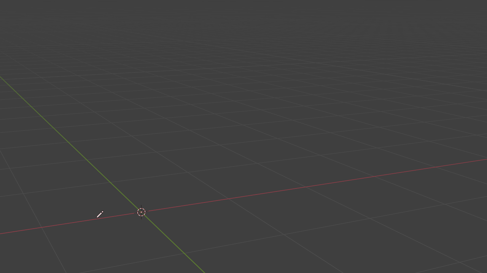
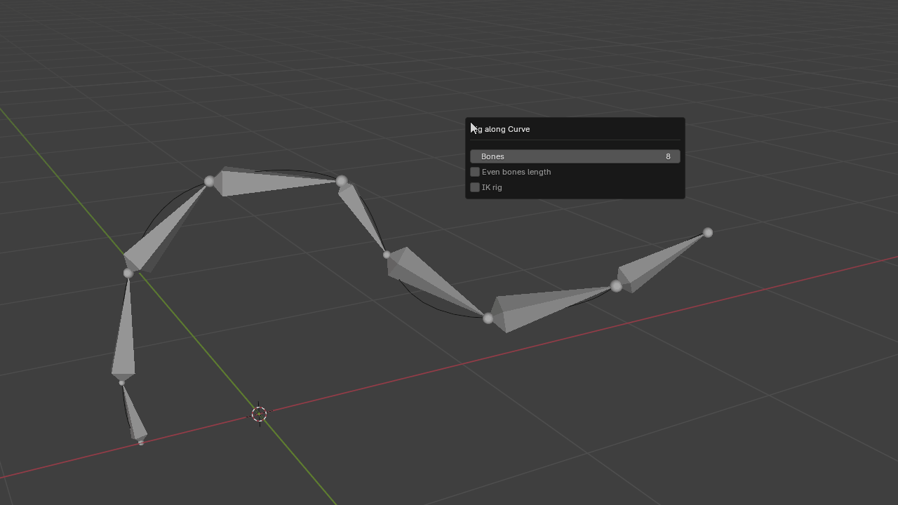
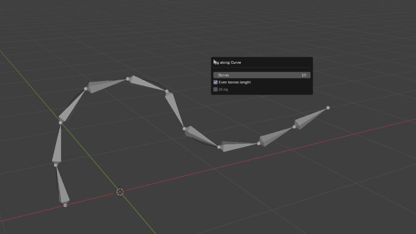
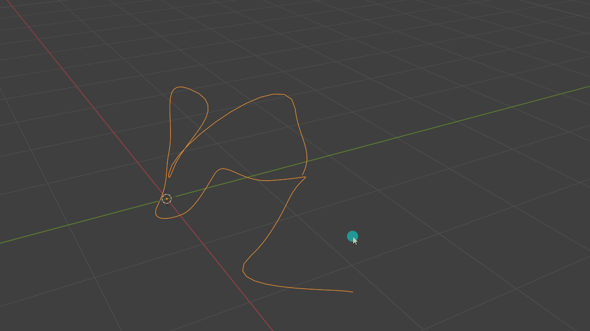

# IKurve
IKurve - IK Rig on curve Addon for Blender
IKurve makes it easy to create armatures along any curve in Blender. Customize your bone count, set even lengths, and add an IK rig with ease.

In Object Mode – just select your curve, right-click menu, and choose "Rig along Curve".

Custom bones count: Adjust the number of bones to match your curve.
Even bones lenght option: Keep bones length uniform.

One-Click IK: Set up an IK rig with an automated target in seconds.

Works with complex curve shapes.

IKurve is here to simplify your workflow, whether you’re crafting complex animations or just need a quick armature along a curve.

